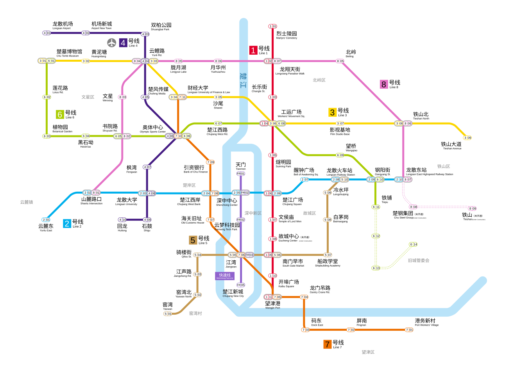

# 龙散战记 · 玩家手册

> 近未来都市生存

## 一、欢迎来到龙散

现在是 2030 年。你生活在 **龙散市** ——一座以"高效、便捷、安全"著称的现代化都市。

人工智能管理系统 T.A.I.Y.I. 调度着这座城市的交通、能源、安防和公共服务。天穹智能钱包串联起你生活的方方面面——支付、身份认证、通行权限，一个应用搞定一切。无人机在头顶配送快递，全息广告在街角闪烁，义体诊所挂着"医保定点"的招牌，地铁 90 秒一班。

这是一座"自由与机遇并存"的城市——至少广告牌上是这么写的。

在《龙散战记》中，你将扮演龙散市的一名普通市民。你有工作，有账单，有信用评分。你不知道城市光鲜表面下藏着什么—— **至少现在还不知道。** 

## 二、世界：2030 年的龙散市

### 2.1 诸夏与龙散

2030 年的诸夏，日常生活的节奏和几年前没什么不同。上班、支付、刷视频、抱怨交通。科技在进步，但生活还是生活。

龙散市位于楚江之畔，是一座有千年历史的古城。它曾是楚地重要的水运码头，也曾是列强租界所在地。今天的龙散是诸夏的科技先锋城市——AI 技术与自动化产业的高地。同时，它也是移民特区，来自各地的劳工在此汇聚，让龙散成为一座文化混杂的现代都市。

但科技的代价是失业。大量传统岗位被 AI 和机器人取代。这座城市里，有人住在绿区的高层公寓享受无人机送货，也有人在红区的废墟里翻找可以卖钱的零件。两种生活只隔几条街。

### 2.2 T.A.I.Y.I.——城市管理系统

 **T.A.I.Y.I.（盘古智能尧级基础网络）** 是龙散市的城市 AI 管理系统。全称 Tatanic Artificial Intelligence Yottascale Infrastructure——"盘古"寓意创世级的基础架构，"尧级"代表 10²⁴ 量级的数据处理能力。

官方宣传中，TAIYI 是城市高效运转的守护者。

- **交通调度** ：实时优化全市信号灯，将平均通勤时间压缩了 32%
- **犯罪预测** ：基于行为数据分析，在案件发生前调配安保力量
- **能源优化** ：动态平衡全市电网负荷，将能耗降低了 18%
- **公共卫生** ：追踪流行病传播链，精准投放医疗资源
对普通市民而言，TAIYI 就是那个在堵车时自动调整信号灯的系统，那个偶尔推送一条"您可能感兴趣"广告的 AI。它无处不在，也无人察觉。

### 2.3 安全信息评级

龙散市实行五级安全信息评级制度。这不是行政身份，而是基于个人社会行为的动态信用评估，由 TAIYI 自动运算。

| 等级 | 名称 | 概述 |
|------|------|------|
| 5 级 | 完全权限 | 默认最高等级，享受完整市民待遇 |
| 4 级 | 良好信用 | 可降至此级，大部分权限保留 |
| 3 级 | 一般信用 | 部分公共服务受限，无法购买进入某些城区的地铁票 |
| 2 级 | 受限 | 仅可暂住和工作，核心公共资源不予开放 |
| 1 级 | 严重受限 | 系统标记为高风险，基本公共服务大多关闭 | **完全权限识别码（CPI）** 持有者默认拥有 5 级信用，享受完整市民待遇。 **限制权限识别码（LPI）** 持有者默认 2 级，可以在龙散工作生活，但无法享受优质医疗、重点学校、公共福利积金等核心公共资源。

评级的升降取决于社会经济行为的长期记录：工作稳定性、借贷还款、消费习惯、出行范围、社交圈层。评级下降可能是缓慢的——某个月你的贷款审批变慢了，下个月你发现某些区域的地铁票买不了。系统不会向你解释原因。客服会说："您的账户正在评估中。"

### 2.4 天穹智能钱包

纸币已在龙散市消失。 **天穹智能钱包** 是每个人数字生活的枢纽——支付、身份认证、通行凭证、安全信息评级，全部集成。

进入不同安防等级的城区、乘坐地铁、申请贷款、预约医院，都需要天穹钱包的权限验证。它不是你的手机上的一个应用——它就是你手机的核心。丢了手机意味着丢了身份。

天穹钱包由 **云梦科技** 运营， **引资银行** 提供金融底层支持。

### 2.5 动态安防分区

龙散市的城市安全由 TAIYI 的动态安防分区系统管理。这不是固定的行政划分，而是实时计算的安全评级——一块区域的"颜色"会随时间和事件波动。

- **绿区** ：安防监控覆盖完善，犯罪率极低。深中新区主体——企业总部、高端商业体、CPI 核心居民区。公开暴力行为会在极短时间内触发安保响应。广告牌上的龙散市，就是绿区。
- **黄区** ：日常城市腹地。普通居民区、一般商业街所在。安防存在规律性盲区，响应有几分钟延迟。大多数市民的生活范围。
- **红区** ：安防薄弱区域。监控长期失效，治安不稳定。LPI 密集的老旧社区、工业废弃地属于此区。在这里，天穹钱包有时会没信号。
- **黑区 / 离线区** ：完全脱离 TAIYI 网络覆盖。旧城灰区深处、废弃矿坑、偏远山区。天穹钱包无法使用，导航一片空白，紧急呼叫无法接通。 **官方建议市民不要进入。** 

一块区域的颜色不是永久的。黄区在发生重大治安事件后可能被临时标定为红区，经过安保力量清理后会恢复。这只是城市安全管理的常规操作。

### 2.6 ETC 绩效评估

 **ETC（Expected Token Cost，预期 Token 消耗）** 是 2030 年企业管理的核心工具。

在一个 AI 能完成大部分工作的世界里，一件任务的价值可以用"解决它需要消耗多少 AI Token"来衡量。一份市场分析报告，值 5000 Token。一次客户投诉处理，值 200 Token。

你的月度绩效大致为：

> **绩效 = α × (总ETC − 你消耗的AI Token数) + β × 你消耗的AI Token数** 
>
> 其中 **α > β** ：系统在奖励"不靠 AI"的产出。

但绝大多数工作根本不可能离开 AI 完成。于是办公室里的日常变成：每个人都在偷偷用 AI，然后在日报里强调"主要思路是我自己想的"。

这句话是悬在龙散市每个打工人头顶的剑：

> **"你的 ETC 甚至不如 AI。"** 

意思是，一个中位数水平的 AI 用更少的 Token 就能干完你的活，质量还比你高。这句话可以来自绩效系统的自动弹窗，也可以来自同事在匿名频道里的嘲讽。

### 2.7 主要企业与机构

龙散市的企业生态围绕 TAIYI 系统分层分布。以下是你作为普通市民日常会接触到的企业。

#### 重黎工业集团
龙散市最大的工业资本。业务涵盖重型机械制造、工业机器人、城市基础设施建设、安保机器人，以及义体部件的正规渠道生产。总部位于深中新区，一栋像垂直要塞的钢筋混凝土大厦。绿区的无人机巡逻系统就是重黎的产品。它对外的口号是"自动化即文明"。

#### 云梦科技
龙散市最大的信息技术集团。 **天穹智能钱包** 的开发商和运营者，同时经营消费电子、云计算与城市数据服务。ETC 评估服务的主要供应商。总部是一栋 88 层的曲面玻璃大厦，位于深中新区。

#### 引资银行
龙散市唯一持牌全能银行。天穹钱包的金融底层——每一笔支付、每一笔贷款、每一个信用评分，都由引资银行的算法实时管理。总部位于楚岸区老租界，一栋建于 1923 年的新古典主义风格大楼，铜制大门上方保留了"THE DRAGON TRUST"的英文字样。

#### 河图科技
来自珠三角的城域 AI 系统公司，核心产品"河图城市智脑"与 TAIYI 功能对标。在龙散市，河图系统主要被非龙散本地资本的中型企业使用，约占本地 12% 的市场份额。同时经营旗下现象级手游 **《九域》** ——一款以中国上古神话为背景的开放世界 MOBA，在龙散市日活用户超过全市人口的 30%。

#### 飞廉速运
龙散市最大的物流企业，覆盖地面无人机配送与地下管道物流网。是唯一一家活跃在绿黄红三区的合法企业——绿区 30 分钟送达，黄区定时配送，红区也有官方不承认但默许的"特殊通道"。大多数配送员是 LPI 持有者。

#### 燧明科技集团
消费电子与芯片制造巨头。产品涵盖智能手机、平板、全息投影终端、自研芯片，以及"乘云"系列智能电动汽车。龙散市街头随处可见燧明的旗舰店和排队买新品的队伍。

#### 丰隆工业集团
机动平台制造商。民用快递无人机和市政巡逻无人机的主力供应商——城市上空每一秒都有数千架丰隆无人机在飞行。也生产工业 AGV 和自动搬运机甲。旗下设有不对外详细披露的防务业务线。

#### 九渊建设集团
龙散市最大的建筑与地下工程企业。绿区天际线的缔造者，同时也是旧城改造、地下管廊、隔离屏障的施工方。持有文物敏感区施工许可证。如果你看到某栋楼在绿区拔地而起，或者某处被九渊的防爆墙封锁——都是同一家公司的手笔。

#### 龙腾轨道交通
地铁及城市轨道交通运营企业。运营 8 条地铁线路和 1 条深中快速线，覆盖全市。地铁是龙散市目前唯一不需要出示信用评级的公共空间——只要支付车费就能乘坐。这使得地铁车厢成为城市中最"平等"的角落。

#### 追风出行
最大的网约出行平台，运营电动汽车、共享单车和即时配送。追风司机大量是 LPI 持有者，租用公司车辆，每天工作 12 小时以上才能覆盖租金和信用维护成本。如果你在龙散市打了一辆车，大概率是追风。

#### 玄盾国际
私人军事承包商。主营业务包括企业安保外包、高风险区域武装押运、旧城警戒区安保。自 2029 年起全权负责旧城灰区的安保工作。你会在旧城隔离墙外看到穿着玄盾制服的义体士兵。

#### 楚风传媒集团
龙散市最大的文娱传媒集团，也是龙散市的文化名片。旗下拥有网络视频平台"楚风视频"、直播平台"楚风直播"，以及位于北岭区占地 200 亩的影视基地。总部"楚风中心"位于楚岸区楚江畔，高 68 层，顶层观景台是龙散市游客打卡第一站。

#### 云鲤互娱
龙散市本土游戏公司，核心产品是战术策略 RPG 手游 **《妖刃计划》（PY）** ——一款以日本妖怪传说为背景的二次元手游，全国手游营收榜稳定前三。公司位于北岭区一栋改造自旧厂房的建筑，楼外画着巨幅角色壁画。在龙散市本地，《妖刃计划》的玩家忠诚度极高，尤其在东北片区。玩家四处出征，大打出手，在网上名声并不美好——不过又有几家手游粉丝名声好的呢？

### 2.8 学术机构

龙散市拥有多所高等院校，其中两所与市民生活和企业招聘关系最为密切。

 **龙散大学** ：综合实力最强的国立大学，尤以生物学和土木工程闻名全国。校园位于文星区，北侧紧邻故城区。土木系毕业生大量进入九渊建设，生物系与云梦科技、燧明科技有联合实验室。校内设有与云梦科技共建的 **21-35 联合研究所** ，配备全市算力最强的九章超算中心。

 **龙散财经政法大学** ：以财会、商科、法律见长的应用型大学，位于深中新区核心地段。毕业生是引资银行、云梦科技和重黎工业招聘的主要目标。校园风格像高端企业园区，学生私下称之为"引资银行附属中学"。

### 2.9 大塌陷与旧城

三年前（2027 年），龙散市旧城区发生了一次重大地质灾害—— **大塌陷** 。地面大面积沉降，摧毁了整片旧城区域。官方公布伤亡上万人，受灾人数达五十万之巨。

塌陷原因为旧城区地质结构不稳定，叠加连年地下物流层大规模开发，引发连锁性地面沉降。

如今，旧城区域已从故城区行政区划中剥离，划归 **旧城区管委会** 直管。在官方地图上，这片约 3.5 平方公里的区域被标注为"市政改造区域"——灰色不能进入的区域。旧城重建计划已推进到第三个年头，九渊建设牵头的重建联合体正在铁山区南部施工。旧城安保由玄盾国际全权负责。

旧城区域内仍有部分失控的旧工业设备自主运转，未经许可不得进入。官方在隔离墙上写着： **"市政改造区域，敬请谅解。"** 

### 2.10 城区与交通一览

龙散市由楚江自北向南穿城而过，分为西岸与东岸。全市设七区二村镇，另设旧城灰区由管委会直管。

| 城区 | 区位 | 常态安防 | 特征 |
|------|------|----------|------|
| **深中新区** | 楚江中央岛 | 绿 | 企业总部、金融中心、财经政法大学 |
| **文星区** | 西岸北段 | 绿为主 | 龙散大学、21-35 联合研究所、学生聚集区 |
| **楚岸区** | 东岸楚江畔 | 绿为主 | 老租界、引资银行总部、楚风传媒地标 |
| **故城区** | 东岸中南部 | 绿黄各半 | 明清老街、LPI 密集社区、老龙散人的生活区 |
| **铁山区** | 东岸东部 | 绿黄各半 | 重黎工业遗迹、旧工业带、义体诊所聚集 |
| **望津区** | 东岸南部 | 绿黄各半 | 港口码头、集装箱物流区 |
| **北岭区** | 东岸北部 | 绿黄各半 | 新兴居住区、云鲤互娱、长乐街日式老街区 |
| **旧城灰区** | 故城区以东 | 灰（离线） | 大塌陷隔离区、旧城区管委会直管 |
| **云麓镇** | 西岸以西山地 | 黄为主 | 古镇、楚墓考古站 |
| **窑湾村** | 南郊 | 黑（离线） | 废弃窑厂、棚户区 |

轨道交通由龙腾轨道交通运营，共 8 条数字线路 + 1 条深中快速线，覆盖七区二村镇。地铁是龙散市最主要的公共交通方式。

## 三、角色创建

### 3.1 你是普通人

在《龙散战记》中，你的角色是龙散市的一名普通市民。你有工作（或者刚刚失去工作），有信用评分，有日常生活的烦恼。

你可能是一个 ETC 绩效不达标的公司职员、一个在黄区开便利店的 LPI 持有者、一个在铁山区帮人修义体的街头技师、一个刚拿到追风租车合同准备每天开 12 小时网约车的司机、一个面临毕业压力的学生，或者一个在旧城重建工地干活的劳工。

 **你不是英雄。至少现在不是。** 

### 3.2 创建规则

本团使用《狂野世界·冒险版》（Savage Worlds Adventure Edition）规则。详细规则请参阅 [核心规则](/核心规则/)。

- **0 级角色：**  角色从 **0 级** （Novice，0 Advances）开始。使用标准 SWADE 角色创建流程。
- **族裔：**  限定人类，获得一个免费的专长。
- **负赘：**  你可以选择负赘来获得额外点数。 **本团可从最多三个主要负赘中获得好处** （即最多 6 点额外点数，每个主要负赘价值 2 点）。
- **专长：**  本团禁止选择"奥法背景"或任何施法相关专长。

### 3.3 角色概念方向

以下是一些适合本团背景的角色概念，供参考：

| 概念 | 可能的职业背景 | 典型技能方向 |
|------|--------------|-------------|
| 公司员工 | 云梦/重黎/燧明的白领 | 通用知识、交涉、研究 |
| 追风司机 | 租车跑网约车的 LPI | 驾驶、察觉、市井门道 |
| 飞廉配送员 | 无人机/AGV 调度或快递 | 驾驶、运动、修理 |
| 街头技师 | 铁山区无执照的义体修理工 | 修理、科学、察觉 |
| 便利店店员 | 黄区 24 小时便利店打工 | 交涉、察觉、潜行 |
| 学生 | 龙散大学或财经政法的学生 | 研究、通用知识、科学 |
| 龙腾轨道员工 | 地铁站务员或维护工 | 修理、察觉、运动 |
| 自由创作者 | 给楚风直播做内容的自由职业 | 表演、交涉、通用知识 |
| 重建工人 | 旧城重建工地的 LPI 劳工 | 运动、修理、力量相关 |
| 游戏开发者 | 云鲤互娱的程序员或美术 | 科学、研究、黑客 |

## 四、城市生存须知

### 信用是通行证

在龙散市，安全信息评级的下降不是一瞬间的——它是缓慢的。你的贷款审批变慢了，你的通行权限缩水了，你的天穹钱包偶尔在付款时"加载失败"。等你意识到的时候，你已经在灰名单里。

保持信用需要：稳定的工作和住址、按时还贷、在绿区和黄区范围内活动。

### 你不该去的地方

龙散市地图上有一些"空白"区域——完全脱离 TAIYI 覆盖的黑区。在这些地方，天穹钱包无法使用，导航一片空白，紧急呼叫无法接通。

有人会告诉你，那些地方什么都没有。也有人会告诉你，那些地方什么都有。作为普通市民，你不需要关心这些。你的日常在绿区和黄区之间，范围不超过地铁线路覆盖的区域。

### 日常科技常识

- **钱包即身份** ：天穹钱包是你最重要的随身物品。没有它，你无法乘车、无法购物、无法证明你是谁。安全评级降到 3 级以下，部分城区的地铁票将无法购买
- **AI 无处不在** ：AI 分析你的消费习惯、出行路线、社交圈，然后为你推送精准的服务和广告，进行"智能生活优化"
- **义体不太罕见了** ：外骨骼、义肢和义眼植入在龙散市并不罕见了。得益于生物学和医学研究的进步，脑机真的诞生了，而且不用插管——强大的AI帮你搞定了大脑皮层测出来的脑电波噪音。合法渠道由重黎工业供应，价格不菲。地下黑市的便宜很多，但没有术后保障，也没有身份登记
- **别搞破坏** ：在绿区破坏公共设施（包括无人机）是重罪。黄区可以试试，只要你看好周围的摄像头。红区没人管，但红区有红区的麻烦

## 五、关于这个世界

1. 除本手册所述内容外，2030 年的龙散市对普通人而言，与几年前没有本质区别
2. 没有任何超自然现象、外星人、丧尸或其他非日常要素——嗯，对，没有
3. 你熟悉的生活方式——上班、消费、刷视频、坐地铁——在 2030 年依然如常，只是多了一些 AI
4. **你的角色在游戏开始时，对这座城市的了解不会超过本手册所写的内容** 

---

> *本团使用《狂野世界·冒险版》（Savage Worlds Adventure Edition）规则。详细角色创建流程与全部专长、负赘、装备规则，请参阅 [核心规则](/核心规则/) 部分。*
