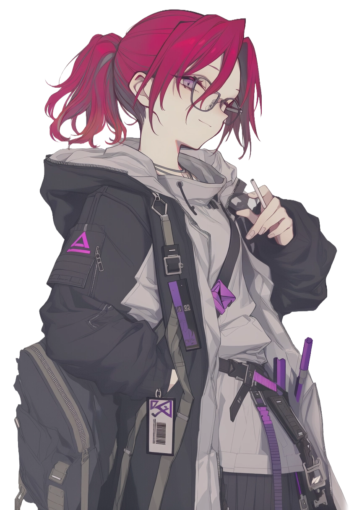
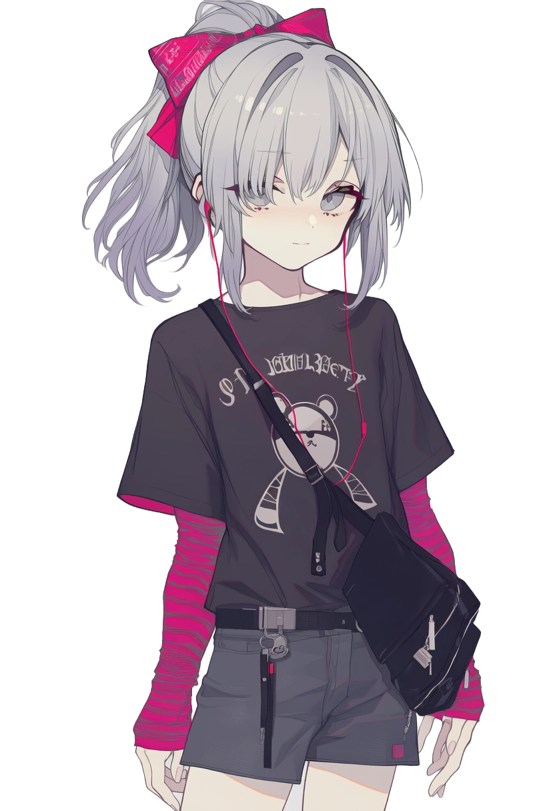
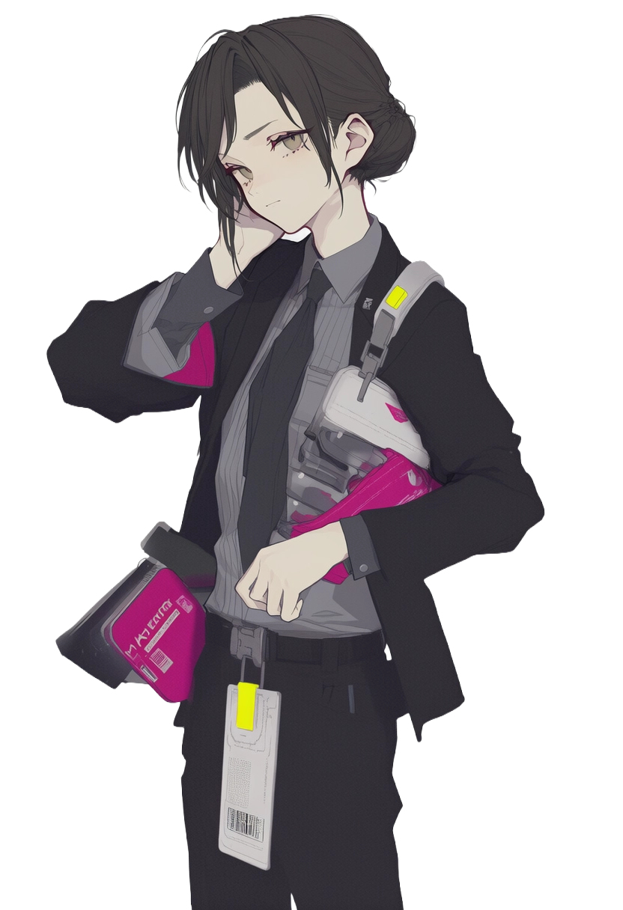
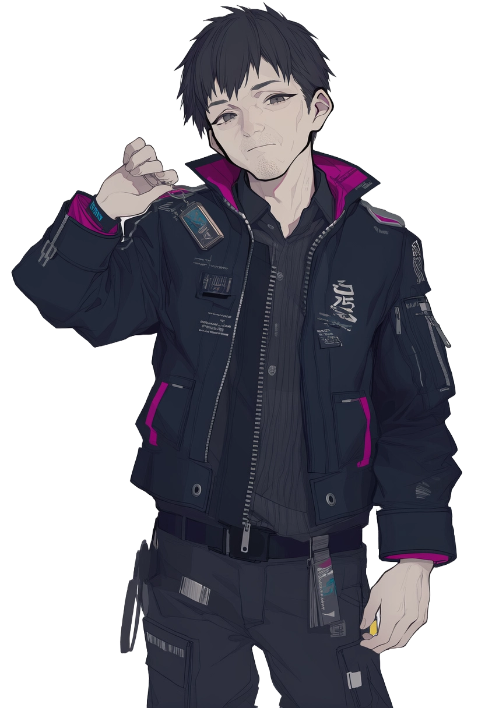

# NPC

龙散市中已确认身份、可被辨认的非玩家角色。

## 随缘事务所与照片线

  <section class="profile-card">
    
    

      <h3>沈漫</h3>
      
随缘事务所 / 城市边缘人脉

      
随缘事务所关联人物。在高铁上主动与李好攀谈，交给他一张阿瑶照片。行事松散，不循常规；烟、红发和紫色火焰状的光影是其视觉标签。

    

  </section>

  <section class="profile-card">
    
    

      <h3>沈仲秋</h3>
      
随缘事务所 / 沈漫的堂弟

      
随缘事务所楼下出现过的清瘦青年。肤色偏白，外貌清秀，带有病弱感。称呼沈漫为堂姐，自称只是借事务所歇脚，不担任正式接待。

    

  </section>

  <section class="profile-card">
    
    

      <h3>阿瑶</h3>
      
照片中的女孩 / 异常线索

      
白发红眼，最初以老照片中的形象被注意到。该照片无法拍摄、复印或手绘复现，目击者的记忆也会在她的外貌上出现偏差。真实身份未公开。

    

  </section>

## 引资银行

  <section class="profile-card">
    
    

      <h3>何凌</h3>
      
引资银行 / 龙散分行

      
龙散分行办公室成员，早于李好抵达龙散。作风冷淡，业务能力过硬。曾接触过与阿瑶照片类似的影像资料，同样无法稳定记忆照片中人的面容。提醒李好将照片妥善保管。

    

  </section>

  <section class="profile-card">
    

    

      <h3>陈志远</h3>
      
引资银行 / 龙散分行主管

      
李好的直接上级。负责引导李好熟悉分行环境和工单池运作，业务扎实，态度友善，但始终处于高压状态。

    

  </section>

## 黄区与委托链

  <section class="profile-card">
    
    

      <h3>周凛</h3>
      
黄区接头人 / 白茅岗麻将房

      
黑崎欲子与唐索的接头人之一。知晓委托目标与旧照片原件有关，但未必知晓照片内容。常出没于白茅岗麻将房等黄区灰色场所。

    

  </section>

## 旧城与公共事务

  <section class="profile-card">
    
    

      <h3>方泰安</h3>
      
旧城区管委会 / 公开事务

      
旧城重建新闻中出现的管委会人物。公开口径围绕透明重建、廉洁监察与旧城治理。在普通市民视野中，他更多是屏幕与官方通报上的名字。

    

  </section>

## 技术、义体与港口

  <section class="profile-card">
    

    

      <h3>翟明珠</h3>
      
云梦科技 / TAIYI 运维

      
云梦科技 TAIYI 运维中心工程师，与阿尔坎相识，曾提供楚钢附近节点的技术入口。

    

  </section>

  <section class="profile-card">
    

    

      <h3>陆文青</h3>
      
重黎工业 / 义体展示

      
重黎工业义体展示人员，曾在义体节展示新一代义眼、接口和义体技术。

    

  </section>

  <section class="profile-card">
    

    

      <h3>何夜白</h3>
      
月下诊所 / 神经接口校准

      
月下诊所神经接口校准技师，负责接口改造前后的参数校准与信号稳定。

    

  </section>

  <section class="profile-card">
    

    

      <h3>宋远</h3>
      
望津区 / 港口物流咨询

      
望津区港口物流咨询相关人物，与凯芙拉接触，名片和印章都指向港口业务。

    

  </section>

  <section class="profile-card">
    

    

      <h3>萨布里娜·费雷拉</h3>
      
外籍社区 / 港口质检协作

      
驻龙散外籍社区联络员，与凯芙拉熟识，参与港口质检相关工作。

    

  </section>

