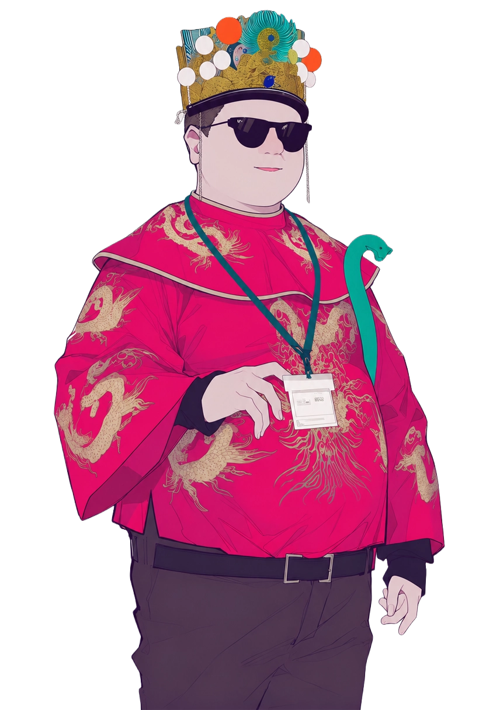
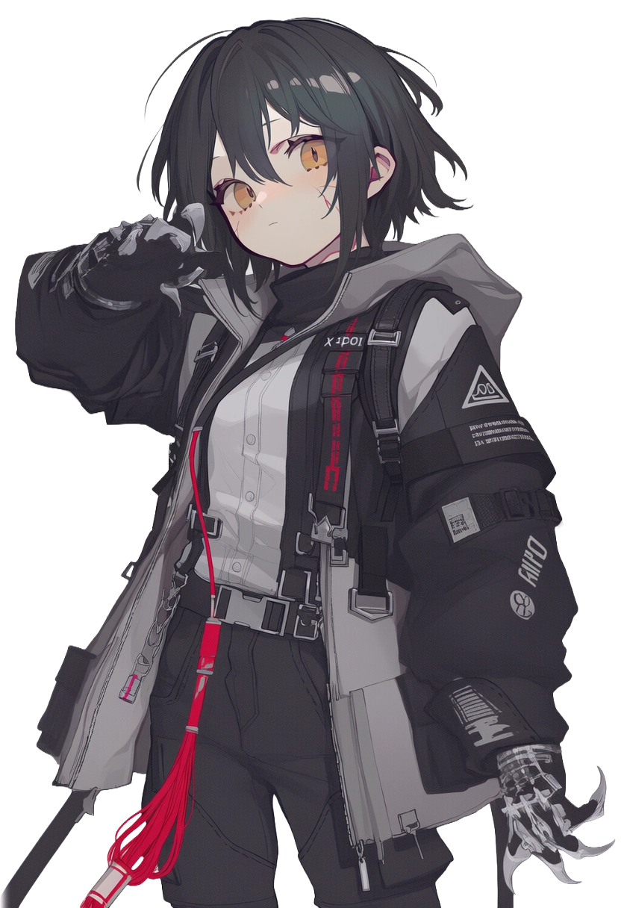
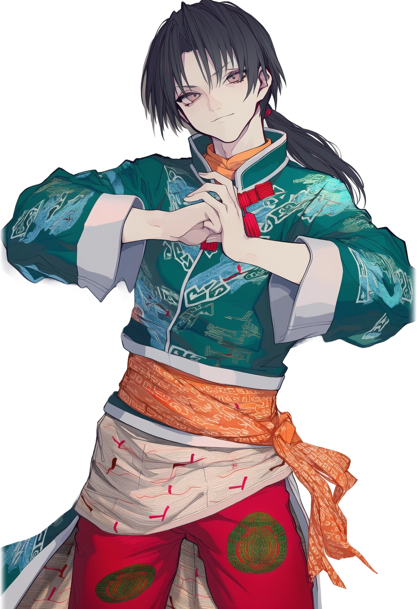
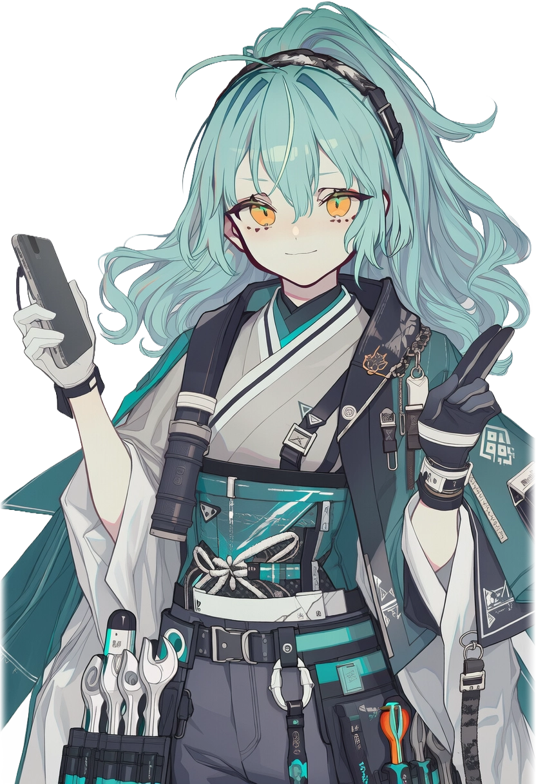

# 玩家角色

进入龙散的六人：银行职员、网约车司机、街面跑腿、地下拳手、大学生、黑客。六条互不交叉的轨迹，因一张无法复现的旧照片而汇聚。

  <section class="profile-card">
    
    

      <h3>李好</h3>
      
引资银行 / 外派龙散

      
从江城调至龙散的银行职员。入城即卷入旧城重建纠纷、异常照片调查和地方势力的三重拉扯。随身携带沈漫交付的阿瑶老照片——该影像无法拍摄、复印或手绘复现。

    

  </section>

  <section class="profile-card">
    
    

      <h3>黑崎欲子</h3>
      
追风出行 / 黄区执行者

      
以网约车司机身份穿越城市各区域，同时承接黄区街面委托。与唐索长期合作，曾受周凛委托接近李好，目标指向一张旧照片原件。

    

  </section>

  <section class="profile-card">
    
    

      <h3>唐索</h3>
      
街面协作者 / 信息跑腿

      
黑崎欲子的同行者，擅长运用手机、AI 与临场话术处理社交、查询和行动。曾以公益互助名义接近李好，在街面行动中担任先头和掩护。

    

  </section>

  <section class="profile-card">
    
    

      <h3>雷武龙</h3>
      
地下拳手 / 临时送货人

      
活跃于地下拳赛与街面委托之间，身体素质远超常人。铁铺取货、龙门调度和码头送货线均与其行动轨迹重合。

    

  </section>

  <section class="profile-card">
    
    

      <h3>凯芙拉·威尔森</h3>
      
文星区学生 / 义体与接口方向

      
龙散大学学生，涉足义体展示、港口质检和技术评估。对义体接口和系统异常反应有超出课业范围的关注，常从校园边界向外追踪城市的技术暗面。

    

  </section>

  <section class="profile-card">
    
    

      <h3>阿尔坎·希耶尔</h3>
      
黑客 / 义体使用者

      
熟悉暗网、加密线索与义体接口。曾处理楚钢附近节点异常，与重黎工业展台、港口坐标和异常数据流均有交集。对 TAIYI 系统的运作间隙比多数同行更早注意。

    

  </section>

